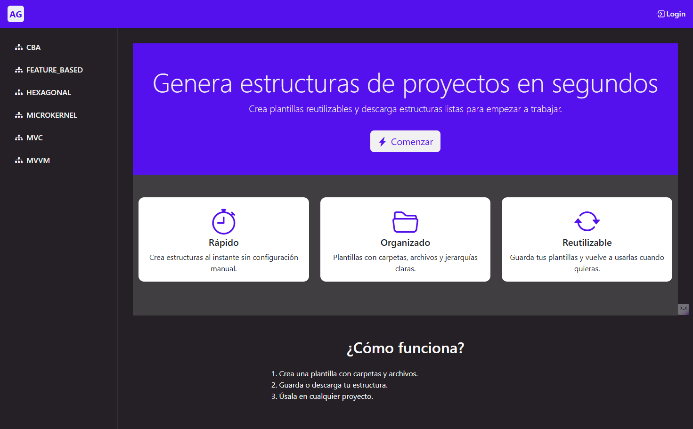
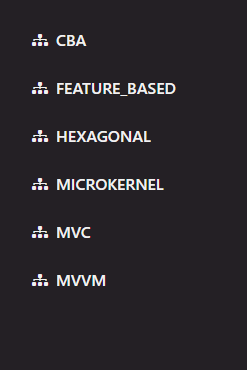
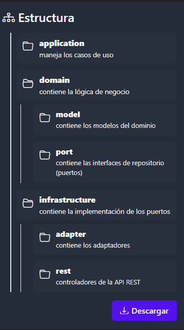
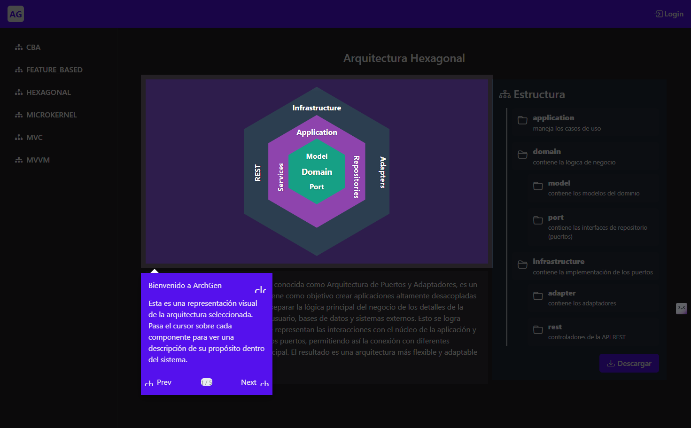
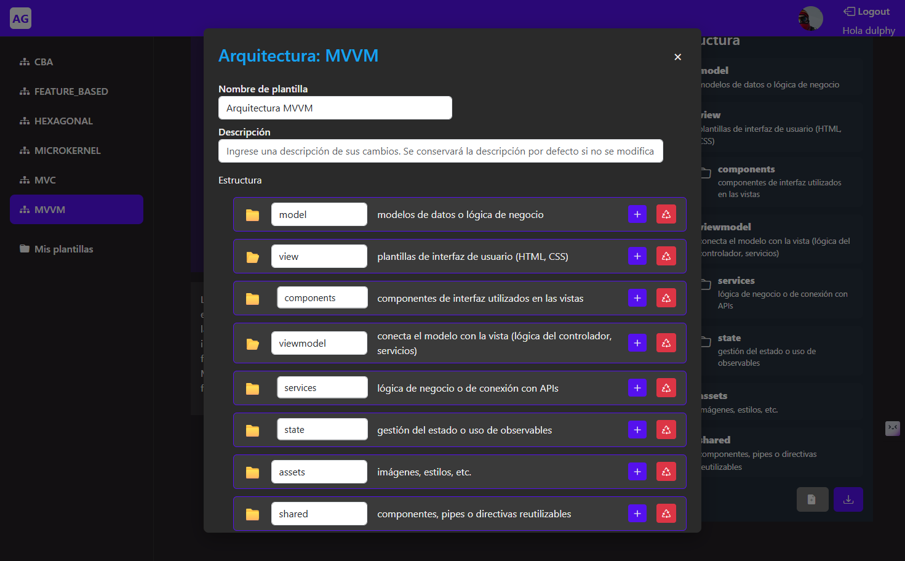
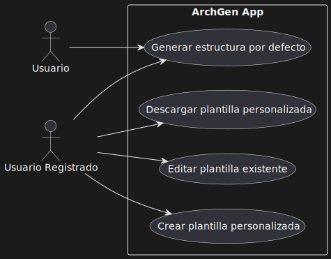
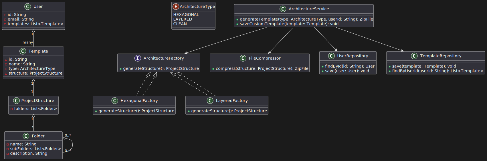
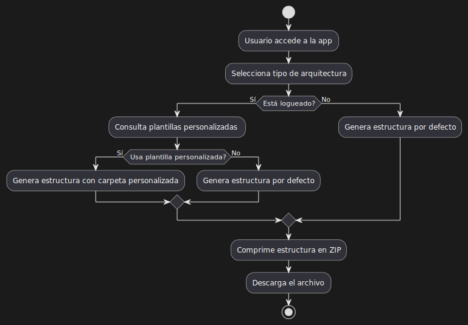
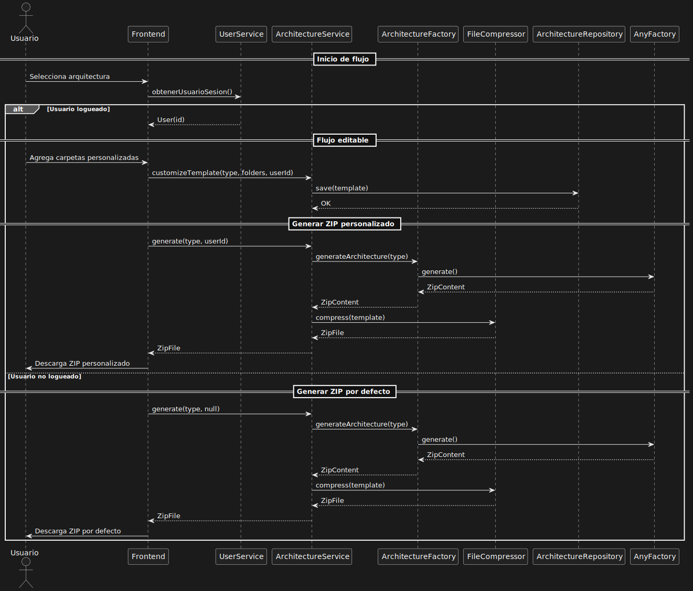

# 🧱 ArchGen — Generador de Arquitecturas de Software

**ArchGen** es una aplicación fullstack que permite generar estructuras base de carpetas para iniciar proyectos con diferentes arquitecturas de software. Puedes seleccionar una arquitectura (como MVC, Hexagonal, etc.), visualizar su estructura, personalizarla, y descargarla como un `.zip`.

---

## 🌐 Demo

🧪 Demo en línea: [http://archgen.site](http://archgen.site) *(modo desarrollo sin HTTPS debido a backend sin certificado SSL)*

📁 Repositorio público: [GitHub - ArchGen](https://github.com/dulphyj/ArchGen)

---

## 📸 Capturas de Pantalla

### 🏠 Inicio

### 🔐 Login con Clerk

### 🧩 Sidebar de arquitecturas disponibles

### 📁 Vista de plantilla estructurada por arquitectura

### 🧑‍🏫 Tour interactivo

### ✍️ Editor de plantillas (para usuarios registrados)

---

## 🧰 ¿Qué hace esta app?

- ✅ Selecciona una arquitectura de software predefinida.
- ✅ Visualiza la estructura de carpetas y archivos.
- ✅ Edita las plantillas si estás registrado.
- ✅ Descarga el proyecto como `.zip`.
- ✅ Tour guiado para nuevos usuarios.

---

## 🔐 Uso de Clerk

ArchGen implementa **Clerk** como sistema de autenticación:

- Inicio de sesión y registro de usuarios con Clerk.
- Protección de rutas: solo los usuarios registrados pueden acceder al editor de plantillas.
- Integración completa del SDK de Clerk en Angular.
- Actualmente en **modo desarrollo** debido a que el backend aún no cuenta con certificado SSL, pero la configuración de producción ya está preparada.

---

## ⚙️ Tecnologías utilizadas

- 🖼️ **Frontend**: Angular
- 🚀 **Backend**: Spring Boot
- 🧾 **Autenticación**: Clerk
- ☁️ **Base de datos**: MongoDB
- 📦 **Empaquetado**: Generación y descarga de archivos `.zip`
- 🧪 **Despliegue**: Sitio accesible en modo desarrollo (sin HTTPS)
- 🐳 **Docker**: Contenerización del backend para facilitar el despliegue

---

## 🧠 Diagramas UML

### 📌 Casos de Uso

### 🧱 Diagrama de Clases

### 🔁 Diagrama de Flujo

### ⏱️ Diagrama de Secuencia

---

## 🚀 Cómo usar la app

1. Visita la demo: [http://archgen.site](http://archgen.site)
2. Recorre el tour para conocer las funcionalidades.
3. Selecciona una arquitectura.
4. Visualiza la plantilla estructurada.
5. Regístrate con Clerk si deseas editar las plantillas.
6. Descarga tu estructura como archivo `.zip`.

---

## 📚 Lecciones aprendidas

Durante la hackatón se desarrollaron varias habilidades clave:

- 🧩 Integración fullstack entre Angular + Spring Boot.
- 🔐 Implementación de autenticación segura con Clerk.
- 📦 Generación de archivos `.zip` personalizados.
- 🧠 Organización visual con diagramas UML.
- 🌱 Mejora de la experiencia del usuario con un tour interactivo.

---

## 🧑‍💻 Autor

Desarrollado por: **[Gonzalo Encinas / GitHub](https://github.com/dulphyj)**  
Proyecto presentado para la **Hackatón de Midudev 2025**.

---

## 📝 Participación en la Hackatón

Este proyecto cumple con todos los requisitos de la Hackatón:

- ✅ Proyecto funcional y desplegado públicamente
- ✅ Uso destacado de **Clerk** para autenticación
- ✅ Repositorio público
- ✅ Documentación y capturas completas
- ✅ Diagramas UML disponibles
- ✅ No es un producto previo en funcionamiento ni con usuarios reales

---

## 🗓️ Entregado el

📅 20 de mayo de 2025

---

## 🔮 Pending Tasks

A futuro, se planea una nueva funcionalidad que aproveche Inteligencia Artificial para mejorar aún más la experiencia del desarrollador. Esta incluiría:

- 🧠 **Generación automática de clases base**: Una IA sugerirá o generará el contenido inicial de las clases dentro de cada archivo de la plantilla, según la arquitectura seleccionada.
- 📈 **Optimización del flujo de desarrollo**: Minimizar el tiempo de inicio de proyectos aún más, generando clases funcionales con estructuras comunes según el tipo de arquitectura y stack elegido.

Esto permitiría a los usuarios empezar con una base no solo estructurada, sino también funcional.

**¡Work in progress! 🛠️**

---

## 📄 Licencia

MIT
